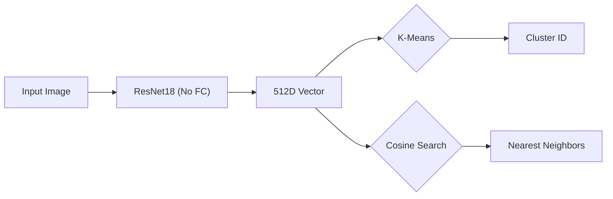

# Semantic Image Clustering with ResNet18 & STL-10

A machine learning pipeline that organizes unlabeled images into semantic clusters using Deep Transfer Learning.

## 🚀 Live Demo
**[Click here to view the Live App on Hugging Face Spaces](LINK_TO_YOUR_HF_SPACE)**

 

## 🧠 Project Overview
This project implements an unsupervised learning pipeline to cluster images based on visual content rather than metadata.

**The Pipeline:**
1.  **Feature Extraction**: Uses **ResNet18** (pretrained on ImageNet) to convert images into 512-dimensional vectors. We utilize **Global Average Pooling** to ensure spatial invariance.
2.  **Dimensionality Reduction**: Vectors are normalized to a standard scale.
3.  **Clustering**: **K-Means** ($K=10$) groups the vectors into semantic categories.
4.  **Inference**: A **Gradio** interface allows users to upload new images and retrieve the nearest visual neighbors via **Cosine Similarity**.

## 📂 Dataset
We use the **STL-10** dataset (Coates et al., 2011), specifically the unlabeled split, to simulate a "wild" unsupervised environment.
- **Resolution**: 96x96 pixels
- **Classes**: 10 (Airplane, Bird, Car, Cat, Deer, Dog, Horse, Monkey, Ship, Truck)

## 🛠️ Architecture



## ⚙️ Installation & Usage

1.  **Clone the repository**

    ```bash
    git clone git@github.com:ExO94/stl10-clustering.git
    cd stl10-clustering
    ```

2.  **Install Dependencies**

    ```bash
    pip install -r requirements.txt
    ```

3.  **Run the Pipeline**

    ```bash
    # Step 1: Extract features from STL-10
    python extract_features.py

    # Step 2: Train the clustering model
    python train_kmeans.py

    # Step 3: Launch the UI
    python app.py
    ```

## 📚 Theory & References

This implementation relies on several key papers:

  * **Deep Residual Learning for Image Recognition** (He et al., 2015)
      * *Usage:* We use the ResNet18 architecture for robust feature extraction.
  * **How transferable are features in deep neural networks?** (Yosinski et al., 2014)
      * *Usage:* Justification for using a frozen feature extractor on a new domain.
  * **k-means++: The Advantages of Careful Seeding** (Arthur et al., 2007)
      * *Usage:* Used for stable centroid initialization.

## 💻 Tech Stack

  * **Core**: PyTorch, torchvision, Scikit-Learn
  * **Data**: NumPy, Pandas
  * **Interface**: Gradio
